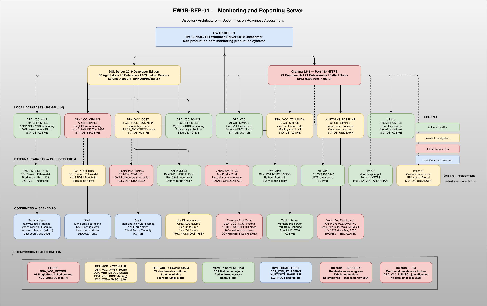

# EW1R-REP-01 — Monitoring & Reporting Server

<!-- Architecture diagram — replace the path below with your exported image -->
<!--  -->

## About This Epic

This repository supports **TECH-3535 — EW1R-REP-01 Decommission Investigation**.

### Purpose

Investigate and document the EW1R-REP-01 monitoring and reporting environment (ew1r-rep-01.ad.shnonprd.kurtosys-internal.net) to establish a complete inventory of workloads, consumers, and dependencies, and produce a decommission readiness assessment with retire / replace / move recommendations.

This epic delivers read-only discovery and documentation only. It does not decommission the server, disable SQL Agent jobs, change Grafana configs, migrate dashboards, or alter production monitoring (separate follow-on epic(s)).

### Background — the problem

The host started as a SQL Server monitoring box but now also runs Grafana, SQL Agent jobs, and monitoring for other systems (RDS MySQL, SingleStore, and others). Platform Engineering intends to decommission this server, but there is no authoritative inventory of what it runs, what it monitors, who consumes the output, or what would break if it were switched off.

Without a structured discovery pass, decommission risks silent loss of alerts, orphaned Grafana dashboards, and undocumented SQL Agent jobs that teams still rely on.

### Why this epic exists

- **Decommission safety** — know every job, dashboard, alert, and external target before any change
- **Operational clarity** — document who uses this server and how (URL/DNS, teams, alert recipients)
- **Migration planning** — classify each component as retire, replace (e.g. CloudWatch, Grafana Cloud, unified monitoring), or move to another host
- **Alignment** with unified database monitoring initiatives (TECH-3428, TECH-3409) where overlap exists

---

## What Is This Server?

EW1R-REP-01 is a **monitoring and reporting hub**. It does not run any product or serve any customers directly. Its sole job is to **watch over other systems and report on what they are doing**.

Here is what it does in plain terms:

- **It collects data** — every 30 minutes to once a day, it reaches out to production SQL Servers, AWS services, MySQL databases, and application APIs. See the full list of what it collects below.
- **It stores that data** — everything collected is stored across 8 databases on the server itself, totalling 369 GB.
- **It serves dashboards** — Grafana (a dashboard tool) runs on this server and reads from those databases. There are 74 dashboards showing things like KAPP API performance, client usage, AWS costs, and application health.
- **It sends alerts** — when something goes wrong (a backup fails, a disk fills up, a server goes down), this server is supposed to fire an alert to email or Slack. Most of the alerting is currently broken or silent.

Think of it as the **eyes of the platform** — it does not run anything, it just watches everything else and reports on it.

---

## What Data Does It Collect?

### From production SQL Servers (EW2P-MSSQL-01 and EW2P-MSSQL-02)
- Are the servers up or down
- Are backups completing successfully
- Disk space levels
- SQL Agent job statuses
- Database sizes and growth
- Failed login attempts
- Index fragmentation levels
- Error log contents

### From AWS
- Every single KAPP API query made — who ran it, when, how long it took
- AWS costs per client/entity
- S3 bucket sizes
- EC2 instance inventory
- RDS instance inventory
- IAM key details
- NiFi data pipeline logs
- Lambda timeout events

### From MySQL / DXM
- DXM client sizes
- DXM backup results
- MySQL server status and version

### From SingleStore/MemSQL (stopped May 2026)
- KAPP workflow run history and timing
- FinancialPortal client data
- InvestorPress client data
- MemSQL node ping stats and status

### From CloudWatch
- Encore application IIS logs (BNY Mellon)
- Jira sprint data (monthly)

---

## Why This Investigation Exists

The team is assessing whether this server can be **decommissioned** (shut down and removed). Before that can happen, we need to understand:

1. What is this server actually doing?
2. Who depends on it?
3. What breaks if it goes away?
4. What needs to be moved or replaced before it can be switched off?

This repository contains all the evidence collected during that investigation — raw query results, findings, and decisions.

---

## What We Found — Plain English Summary

### The server is a non-production server monitoring production systems
This is the most important thing to understand. EW1R-REP-01 lives in a non-production environment, but it is actively monitoring **EW2P-MSSQL-01 and EW2P-MSSQL-02** — two production SQL Servers. If this server is switched off without a replacement plan, those two production servers go completely dark. Nobody will see backup failures, disk problems, or SQL errors on them.

### 8 databases, 369 GB of data
| Database | Size | What it does | Safe to remove? |
|---|---|---|---|
| DBA_VCC_AWS | 182.66 GB | Tracks every KAPP API query, AWS costs, NiFi pipeline logs | No — consumers not confirmed |
| DBA_VCC_MEMSQL | 75.50 GB | Was monitoring SingleStore/MemSQL — all jobs stopped May 2026 | Pending — need to know why jobs stopped |
| KURTOSYS_BASELINE | 50 GB | Captures performance baselines across databases | Pending — nobody confirmed who reads this |
| DBA_VCC_MYSQL | 25.62 GB | Monitors MySQL and DXM — partially broken | Pending — fix broken jobs first |
| DBA_VCC | 20.86 GB | Core monitoring framework — watches production SQL Servers | No — production servers depend on this |
| DBA_VCC_COST | 5 GB | Tracks usage counts for 280 real institutional clients | No — possible client-facing data |
| DBA_VCC_ATLASSIAN | 2 GB | Jira data — no new data written since December 2023 | Pending — confirm nobody reads it |
| Utilities | 0.18 GB | DBA tooling and maintenance scripts | Decommission last |

### 63 SQL Agent jobs — the things that collect all the data
- **52 are running** and mostly healthy
- **11 are disabled** — all MemSQL-related, switched off in May 2026 for unknown reasons
- **2 are failing every single day** — both caused by WPv2 being decommissioned years ago but never cleaned up. The jobs try to connect to servers that no longer exist. No alert fires when they fail — the failures are invisible unless someone manually checks.

### 109 linked servers — connections to other systems
- **46 are reachable** and working
- **63 are dead** — pointing at servers that no longer exist. 30 of these are safe to drop immediately.

### The biggest risks right now
1. **280 institutional clients** (BlackRock, BNY Mellon, Aberdeen, Wellington etc.) have their usage data stored in DBA_VCC_COST. This database is on FULL recovery — meaning someone deliberately treated it as production-critical. A Grafana dashboard called "KAPP Client Utilisation and Growth Report" reads from it and may be shown directly to clients. This is the highest-risk dependency on the server.
2. **14 Grafana dashboards have been showing stale data since May 2026** — when the MemSQL jobs were disabled, nobody noticed and no alert fired. Those dashboards are still live and still being viewed.
3. **2 jobs have been failing every day** since WPv2 was decommissioned — silently, with no alert, for months.
4. **Backup jobs copy to S3 with no encryption** — compliance risk.

### Decommission readiness
- **40% can be retired** — dead linked servers, broken MemSQL jobs, legacy WPv2 data
- **40% must be migrated** — active monitoring, Grafana, DBA_VCC_COST, DBA_VCC_AWS
- **20% is unknown** — waiting on stakeholder answers

**The server cannot be decommissioned until 6 questions are answered** by tashvir.babulal, rayhaan.suleyman, and yogeshwar.phull. Realistic timeline is **10–12 weeks from stakeholder sign-off**.

---

## Purpose of This Repository

This repository is the **evidence and proof layer** for the EW1R-REP-01 decommission investigation.

It contains raw query outputs, screenshots, and supporting artefacts collected during discovery.

Full documentation, findings, analysis, and decisions live in **Confluence**.

> Confluence: [EW1R-REP-01 Decommission Investigation](https://kurtosys-prod-eng.atlassian.net/wiki/spaces/TM/pages/6841237572)

---

## Related Jira Tickets

| Ticket | Theme | Status | Scope |
|---|---|---|---|
| TECH-3535 | Planning & Discovery | In Progress | Read-only discovery — feeds all theme tickets |
| TECH-3560 | Theme A — SQL Server | In Progress | SQL Server inventory, jobs, databases, linked servers |
| TECH-3561 | Theme B — Grafana | In Progress | Grafana datasources, dashboards, users, alerts |
| TECH-3562 | Theme C — Targets & Consumers | In Progress | External targets, consumers, dependencies, firewall |
| TECH-3563 | Theme D — Classification & Topology | In Progress | Topology, classification, decommission decision |

---

## Repository Structure

Each folder maps directly to a Jira ticket. Everything inside belongs to that ticket's scope.

```
TECH-3535-planning-and-discovery/
│
│   discovery-queries.sql            ← All SQL queries used during investigation (14 sections)
│   discovery-summary.md             ← Master consolidation doc — all themes, findings, blockers
│   open-questions.md                ← All open questions, blockers, and active findings (36 questions)
│   investigation-log.md             ← Critical findings with query evidence (6 findings)
│   presentation.md                  ← Full presentation document — architecture, themes, decommission readiness
│   ew1r-rep-01-architecture.drawio  ← Architecture diagram — 4 AWS region swimlanes
│
TECH-3560-theme-a-sql-server/
│
│   sql-server-inventory.md          ← Databases, jobs, linked servers, service accounts, stored procs
│   investigation-log.md             ← Theme A findings
│
TECH-3561-theme-b-grafana/
│
│   grafana-inventory.md             ← Datasources, dashboards (74 confirmed), users, alert rules
│   investigation-log.md             ← Theme B findings
│
TECH-3562-theme-c-targets-and-consumers/
│
│   external-targets.md              ← External targets and connections
│   consumers-and-dependencies.md    ← Consumers, service accounts, firewall rules
│   investigation-log.md             ← Theme C findings
│
TECH-3563-theme-d-classification-and-topology/
│
│   topology-and-classification.md   ← Topology map and classification outputs
│   investigation-log.md             ← Theme D findings
│
TECH-3410-current-sprint/
│
│   decommission-readiness.md        ← 40/40/20 split, 6 blockers, 5-phase plan
│   open-questions.md                ← Sprint-level open questions tracker
│   database-inventory.md            ← Per-database findings and resolutions
│   job-inventory.md                 ← 63 jobs — status, failures, proposed resolutions
│   linked-server-inventory.md       ← 109 linked servers — reachability and cleanup plan
│   theme-a-summary.md               ← Theme A consolidated summary
│   theme-b-grafana-inventory.md     ← Theme B Grafana full inventory
│   zabbix-alert-inventory.md        ← Zabbix alert inventory
│   slack-alert-inventory.md         ← Slack alert inventory
│   sql-agent-alerts.md              ← SQL Agent alert configuration
│
README.md                            ← This file
```

---

## Progress at a Glance

| Ticket | What Has Been Done |
|---|---|
| TECH-3535 | Server confirmed live. 8 databases (369 GB — exact sizes confirmed 2026-07-20). 63 jobs (52 enabled, 11 disabled). 109 linked servers. ~600 stored procs across 8 databases. All discovery queries written and run across 14 sections. 36 open questions raised. 6 critical findings documented with query evidence. S3 backup buckets confirmed — retention TBC (check S3 lifecycle rules). |
| TECH-3560 | SQL Server inventory complete — databases, jobs, linked servers, service accounts, stored proc inventory all confirmed. Critical findings: WPv2 linked servers dead (26 consecutive daily failures since 2026-06-12), MemSQL jobs disabled since May 2026, AWS cost ETL silently broken since Sept 2024, MERGE performance risk on 563M row table. SP_AUDIT_WPv2_CLIENTS_DETAILED last modified 2022-11-01 — never updated after WPv2 decommission. |
| TECH-3561 | Grafana inventory complete — 21 datasources, 74 dashboards confirmed (query 9.5 + 13.7), 8 users (5 admins, 3 viewers — 3 active admins, 2 inactive), 3 alert rules, 3 contact points (2 active Slack, 1 broken email placeholder). Inactive credentials flagged (donovan.vangraan still used in 4 Zabbix datasources). Default admin account flagged. 10 dashboards actively maintained in 2025. |
| TECH-3562 | External targets identified. DBA_VCC_COST confirmed active Grafana datasource (4 dashboards). DBA_VCC_MEMSQL confirmed broken datasource (14 dashboards stale since May 2026). DBA_VCC_COST confirmed client billing data — 280 real institutional clients across EW2, UE1, EC1. KAPP Client Utilisation and Growth Report confirmed client-facing. All 9 collection tables stale since 4 May 2026 — 11+ consecutive silent zero-row runs confirmed 2026-07-20. S3 backup buckets confirmed — retention TBC (check S3 lifecycle rules). |
| TECH-3563 | Topology map and component classification written. Validated 2026-07-20 — all Theme C findings re-confirmed from live queries. Preliminary decommission recommendation documented — server not safe to decommission until 6 stakeholder questions answered (Q13, Q21, Q22, Q23, Q35, Q36). Blocked on consumer confirmation from tashvir.babulal / rayhaan.suleyman / yogeshwar.phull. |

---

## Server Details

| Property | Value |
|---|---|
| Hostname | EW1R-REP-01 |
| IP Address | 10.72.8.216 |
| DNS (Replication) | ew1r-rep-01.ad.shnonprd.kurtosys-internal.net |
| DNS (Primary) | dbe-reports.shnonprd.kurtosys-internal.net |
| Platform | AWS EC2 — Ireland (eu-west-1) |
| Environment | Shared NonProd (REL) |
| SQL Server Version | Microsoft SQL Server 2019 (RTM-CU32-GDR) 15.0.4455.2 |
| Edition | Developer Edition (64-bit) |
| OS | Windows Server 2019 Datacenter (AWS EC2 — Hypervisor) |
| Grafana Version | 9.5.2 — port 443 (HTTPS) |
| Monitoring role | Non-production host monitoring production systems |
